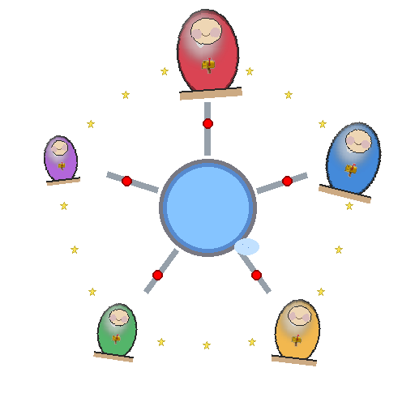

# Matryoshka — Layered Inter-Thread Communication

One layer at a time. Stop when you have enough.

[](https://github.com/g41797/matryoshka/actions/workflows/ci.yml)


---


## What changes in your head

You write multi-threaded code.
Data moves between threads.

Before Matryoshka you think:
- who locked what
- who waits
- who frees

With Matryoshka you think:
- where does this chunk go next
- who owns it right now
- when do I return it to the pool

That is the only real change.

---


## What Matryoshka really is

- Matryoshka is a set of Russian nesting dolls.
- Each doll is complete by itself.
- You open only the dolls you need right now.
- You stop when you have enough.
- You go deeper only when the next doll solves a real problem you have today.
- You never pay for features you do not use.

---

## Your four dolls

| Doll | What you get | What you still do not need |
|------|--------------|----------------------------|
| 1    | PolyNode + Maybe | everything else |
| 2    | + Pool (`on_get` / `on_put` hooks) | extended pool, mailbox |
| 3    | + extended pool (flow control, free-list) | mailbox |
| 4    | + Mailbox | — full system |

**Rule:** open the next doll only because you need it — never because it is there.

---

## Doll 1 — PolyNode + Maybe

You only have one struct and one rule.

```odin
PolyNode :: struct {
    using node: list.Node, // link inside your data
    id:         int,       // 0 is forbidden — tells the type
}
```

Every item you move must put `using poly: PolyNode` as the very first field.

```odin
Chunk :: struct {
    using poly: PolyNode,
    file_id: int,
    data:    [4096]byte,
}
```

Maybe tracks ownership.

```odin
m: Maybe(^PolyNode)
```

- `m^ == nil` → not yours
- `m^ != nil` → yours — you must give it away or clean it up

With only Doll 1 you can already build real things:

- intrusive lists in one thread (no extra allocations)
- simple game entity systems (entities live in one list at a time)
- single-threaded pipelines (read → process → write)
- any system where data moves instead of being shared

No locks. No threads yet. Just clean ownership.

---

## Doll 2 — Pool

Now you add recycling.

Pool holds items.
It never knows your types.
All smarts live in your hooks.

```odin
PoolHooks :: struct {
    ctx:    rawptr,
    ids:    [dynamic]int,  // which item types this pool handles — you fill before pool_init
    on_get: proc(ctx: rawptr, id: int, count: int, m: ^Maybe(^PolyNode)),
    on_put: proc(ctx: rawptr, count: int, m: ^Maybe(^PolyNode)),
}
```

`on_get` is called on every get.
- `m^ == nil` — no item available — create a new one
- `m^ != nil` — recycled item — reinitialize it for reuse

`on_put` decides: keep it or throw it away.
- set `m^ = nil` to dispose
- leave `m^` non-nil to store back

You start simple:

```odin
on_get: if m^ == nil { m^ = new(...) } else { reset(m^) }
on_put: always leave non-nil  // pool keeps it
```

Same system as Doll 1, just no leaks.

Later you grow the same hooks:

- count > 400 → dispose (backpressure)
- use your own arena
- add stats

Pool code never changes.
Only your hooks become smarter.

With Doll 1 + 2 you can build:

- compression pipeline (chunks live forever in the pool)
- game object pool (enemies, bullets, particles)
- any system that creates and destroys the same shapes again and again

Still one thread. Still no mailbox.

---

## Doll 3 — Extended Pool

> **Not yet implemented.**

Same Pool from Doll 2.
Add flow control and a free-list per item type.

- per-id `in_pool_count` — how many items of this type are idle
- `on_get` and `on_put` receive the count — your hook uses it for backpressure
- soft limits without changing pool internals

When your Doll 2 hooks start carrying too much policy logic — open Doll 3.

---

## Doll 4 — Mailbox

> **Not yet implemented.**

Now you add threads.

Mailbox moves items between threads.

One sender thread.
One receiver thread.

You call:

- `mbox_send` → ownership leaves you
- `mbox_wait_receive` → ownership comes to you

- It blocks when empty.
- It wakes when something arrives.
- Timeout supported.
- Receiver can be interrupted without touching the sender.

You still use the same Pool from Doll 2.

With all four dolls you can build the full compression example:

Main thread
- reads file
- gets chunk from pool
- sends ==>

Worker thread
- waits
- ==> receives
- compresses
- sends progress back ==>
- sends compressed back ==>

Main thread
- ==> receives progress and updates bar
- ==> receives data and writes file

No shared arrays.
No locks in your code.
Just:
- "get → fill → send" and
- "wait → process → put"

---

## How the same system grows

Start with Doll 1.
Make a single-thread game that moves entities in one list.

Open Doll 2.
Add a pool.
Now you recycle enemies instead of new/free every time.

Open Doll 3.
Add flow control to the hooks.
Now backpressure is one counter check in `on_put`.

Open Doll 4.
Add one worker thread.
Now compression runs in the background.
Mailbox supports safe multithreaded fan-in and fan-out patterns.

Every step uses exactly the same vocabulary:

- get from pool
- fill
- send
- receive
- put back

Only the hooks grow when you need control.
Only the mailbox changes when you need speed.

---

## Names you can use

We give clear short names so you never guess.

| Concept | Matryoshka name | What it does |
|---------|-----------------|--------------|
| queue | Mailbox | moves data between threads |
| object pool | Pool | recycles your structs |
| node | PolyNode | the link inside every item |
| ownership flag | Maybe | tells who owns the item now |

Use these names in your code and comments.
Everyone on the team will understand.

---

## The compression picture (with dolls)

```
Main (Doll 4)
  ↓ Chunk (PolyNode)
Mailbox (Doll 4)
  ↓
Worker 1..N
  ↓ Progress + CompressedChunk
Mailbox (Doll 4)
  ↓
Main (Doll 4)
```

All items come from one Pool (Doll 2).
All transfers use Maybe ownership.

---

## Takeaway

Matryoshka is not a big library.

It is four small complete pieces.

You open them one by one.

You speak the same simple words at every level:

- I get it from the pool.
- I fill it.
- I send it.
- I receive it.
- I put it back.

If that sentence describes your whole program,
the design works.

That is all.

---

Don't shoot the
AI image generator; he's doing his best! 🤖🎨
