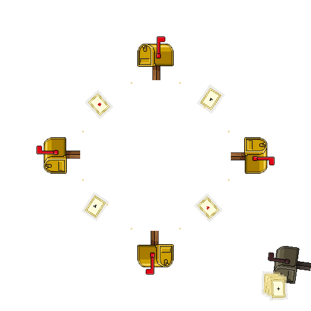

# odin-mbox

The endless inter-threaded game...

[](https://github.com/g41797/odin-mbox/actions/workflows/ci.yml)


---

## A bit of history

Mailboxes are an old idea. They were part of the [actor model in **1973**](https://en.wikipedia.org/wiki/Actor_model):
> Actors can separate receiving a message from doing the work.
> A mailbox is just a queue (FIFO) for those messages.

I first found them in the late 80s:
> "A **mailbox** is for threads to talk.
> Task A sends an object to Task B.
> Task B goes to the mailbox to get it.
> If nothing is there, Task B can wait."
>
> **iRMX 86™ NUCLEUS REFERENCE MANUAL** *Copyright © 1980, 1981 Intel Corporation.*

Since then, I have used it in:

|     OS      | Language(s) |
|:-----------:|:-----------:|
|    iRMX     |  *PL/M-86*  |
|     AIX     |     *C*     |
|   Windows   |  *C++/C#*   |
|    Linux    |    [Go](https://github.com/g41797/kissngoqueue)     |
|     L/W/M   |    [Zig](https://github.com/g41797/mailbox)   |

**Now it's Odin time!!!**

---

## Why use it?

Odin has [channels](https://pkg.odin-lang.org/core/sync/chan/). Use them if they work for you

**mbox** helps when you need:

- **Zero copies**: No data copying. It links your struct directly.
- **Recycling**: Use a pool to reuse messages. No new allocations per send.
- **nbio**: Wakes the `nbio` loop when a message arrives.
- **Timeouts**: Stop waiting after a certain time.
- **Interrupts**: Wake a thread without sending a message. One-time signal.
- **Shutdown**: Close the mailbox and get back undelivered messages.


## How it works (Intrusive)

A normal queue allocates a "node" to hold your data.

**mbox** is different. The "node" lives inside your struct. This is why it's called "intrusive".

- No hidden allocations.
- **One place only**: A message can only be in one mailbox at a time.
- **Clear ownership**: You own the memory, but the mailbox owns the reference (the link) while it is queued.
- **Handover**: When you call `receive()` or `close()`, the mailbox hands the reference back to you

### Your struct contract

Your struct must have a field named `node` of type `list.Node`.

```odin
import list "core:container/intrusive/list"

My_Msg :: struct {
    node: list.Node,  // required
    data: int,
}
```

The compiler checks this for you. If the field is missing, it won't compile.

> If you also use the `pool` package, add an `allocator: mem.Allocator` field.
> The pool sets it on every `get`. The compiler enforces this too.

---

## Two mailbox types

| Type | For | How it waits |
|---|---|---|
| `Mailbox($T)` | Worker threads | Blocks the thread until a message arrives. |
| `Loop_Mailbox($T)` | nbio loops | Wakes the loop. Never blocks the thread. |

Both are thread-safe. Both have zero allocations for sending or receiving.

---

## Examples

| Example | Description |
| :--- | :--- |
| [Endless Game](examples/endless_game.odin) | 4 threads pass a single heap-allocated message in a circle. |
| [Negotiation](examples/negotiation.odin) | Request and reply between a worker thread and an `nbio` loop. |
| [Life and Death](examples/lifecycle.odin) | Full flow: from allocation to cleanup. |
| [Stress Test](examples/stress.odin) | Many producers, one consumer, pool-based message recycling. |
| [Interrupt](examples/interrupt.odin) | How to wake a waiting thread without sending a message. |
| [Close](examples/close.odin) | Stop the game and get back all unprocessed messages. |
| [Master](examples/master.odin) | Pool + mailbox owned by one struct. Coordinated shutdown. |
| [Pool Wait](examples/pool_wait.odin) | N players share M tokens (M < N); players wait for a recycled token. |

See the [Pool section](#pool) below for message recycling.

---

These are not finished "production" code.
They are just small tips to show you the game...

---

## Quick start

> **Warning**: Never send stack-allocated messages across threads.
> The stack frame can be freed before the receiving thread reads the message.
> Always allocate messages on the heap (`new`) or use a pool.

### Basic Send and Receive

```odin
// sender thread:
msg := new(My_Msg)
msg.data = 42
mbox.send(&mb, msg)

// receiver thread:
got, err := mbox.wait_receive(&mb, 100 * time.Millisecond)
if got != nil { free(got) }
```

### Interrupt a Waiter

```odin
// from any thread:
mbox.interrupt(&mb) // waiter gets .Interrupted
```

### Close and Drain

```odin
// shutdown:
remaining, _ := mbox.close(&mb) // all waiters get .Closed

// free every undelivered message:
for node := list.pop_front(&remaining); node != nil; node = list.pop_front(&remaining) {
    msg := container_of(node, My_Msg, "node")
    free(msg) // or pool.put if using a pool
}
```

### nbio loop mailbox

For `core:nbio` event loops. It wakes the loop instead of blocking.
Handle commands and I/O on one thread.
A no-op makes wake-up work on all systems.

```odin
// nbio loop (receiver thread):
loop_mb.loop = nbio.current_thread_event_loop()

for {
    nbio.tick() // process I/O and wake-up tasks
    for msg, ok := mbox.try_receive_loop(&loop_mb); ok; msg, ok = mbox.try_receive_loop(&loop_mb) {
        // handle message, then free or return to pool
    }
}

// sender thread: allocate on heap, send.
msg := new(My_Msg)
mbox.send_to_loop(&loop_mb, msg)
```

---

## Lifecycle of a Message

This example shows the full lifecycle: allocation, interruption, and cleanup.

```odin
import mbox "path/to/odin-mbox"
import list "core:container/intrusive/list"

mb: mbox.Mailbox(My_Msg)

// 1. Create a message.
// You own the memory.
m := new(My_Msg)
m.data = 100

// 2. Interrupt the game.
// Wakes the next waiter with .Interrupted.
mbox.interrupt(&mb)

// 3. Send the message.
// The mailbox now owns the reference (the link).
mbox.send(&mb, m)

// 4. Shutdown.
// close() hands back all references to you.
remaining, _ := mbox.close(&mb)

// 5. Cleanup.
// You must free anything the mailbox handed back.
for node := list.pop_front(&remaining); node != nil; node = list.pop_front(&remaining) {
    msg := container_of(node, My_Msg, "node")
    free(msg)
}
```

## Pool

To reuse messages, use the `pool` package.

```odin
import pool_pkg "path/to/odin-mbox/pool"
import "core:mem"
import "core:time"

// Your struct — both fields required when using pool.
My_Msg :: struct {
    node:      list.Node,     // required by mbox and pool
    allocator: mem.Allocator, // required by pool
    data:      int,
}

// Setup:
p: pool_pkg.Pool(My_Msg)
if ok, _ := pool_pkg.init(&p, initial_msgs = 64, max_msgs = 256, reset = nil); !ok {
    return
}

// Sender: get from pool, fill, send.
// .Always (default): allocates new if pool empty.
msg, _ := pool_pkg.get(&p)
msg.data = 42
mbox.send(&mb, msg)

// .Pool_Only + timeout: wait up to 100 ms for a recycled message.
msg2, status := pool_pkg.get(&p, .Pool_Only, 100 * time.Millisecond)

// Receiver: receive, use, return to pool.
got, err := mbox.wait_receive(&mb)
if err == .None { pool_pkg.put(&p, got) }

// Cleanup:
pool_pkg.destroy(&p)
```

See [design/mbox_examples.md](design/mbox_examples.md) for the MASTER pattern (pool + mailbox, coordinated shutdown).

---

## Best Practices

1. **Ownership.** Once you send a message, don't touch it. It belongs to the mailbox until someone receives it.
2. **Heap.** Always use heap-allocated messages across threads. Never use stack allocation.
3. **Cleanup.** Use `close()` to stop. Undelivered messages are returned to you—free or return to pool.
4. **Threads.** Always wait for threads to finish (`thread.join`) before you free the mailbox itself.


---

## Learn more

- [design/mailbox_design.md](design/mailbox_design.md) — architecture details
- [design/mbox_examples.md](design/mbox_examples.md) — common usage patterns

---

## License

MIT

---

## Forewarned is forearmed

Remember the *First Rule of Multithreading*:
> **If you can do without multithreading -- do without.**

*Powered by* [OLS](https://github.com/DanielGavin/ols) + [Odin](https://odin-lang.org/)
