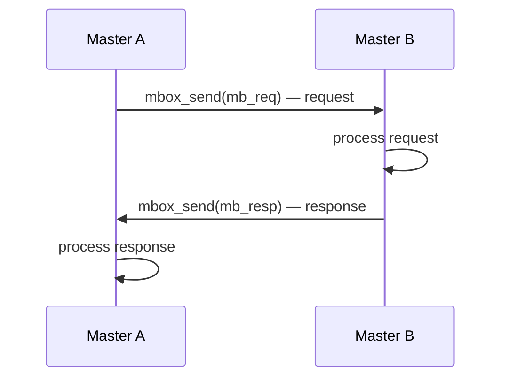
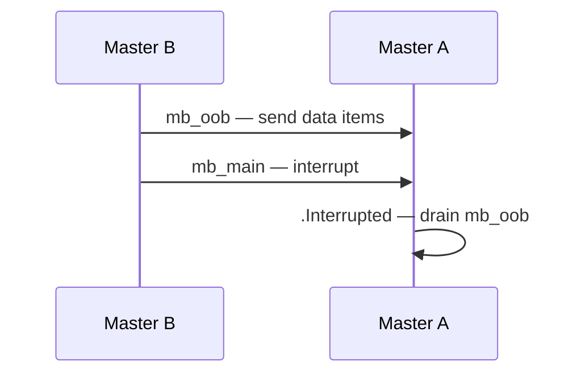
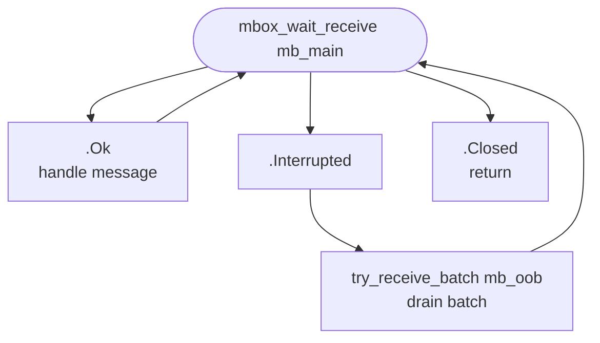
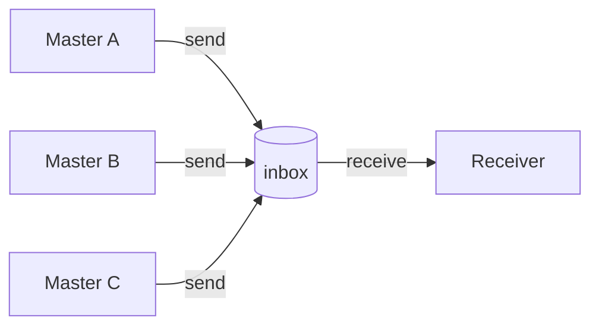
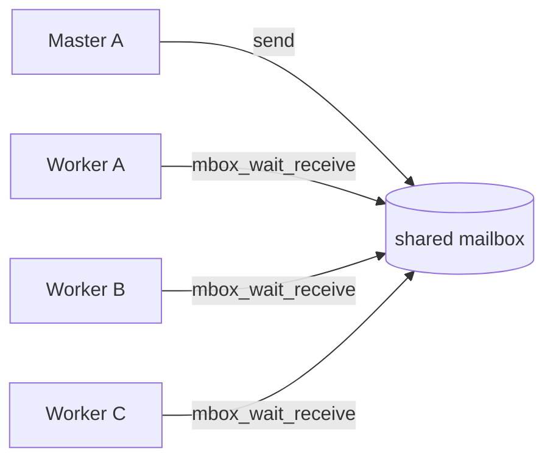
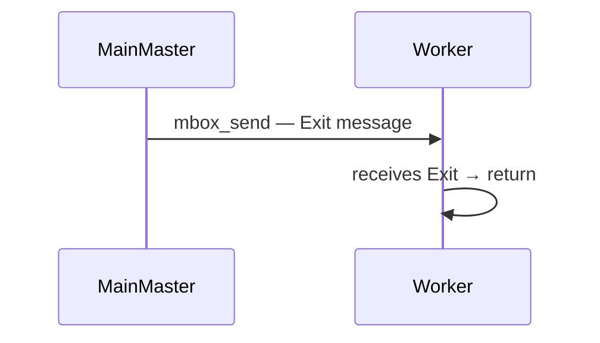

# Layer 2 — Mailbox + Master — Deep Dive

> See [Quick Reference](layer2_quickref.md) for API signatures and contracts.\
>\
> **Prerequisite:** [Layer 1](layer1_quickref.md) (PolyNode, Maybe, Builder).

---

## Receiver loop with interrupt

```odin
for {
    m: Maybe(^PolyNode)
    switch mbox_wait_receive(mb, &m) {
    case .Ok:
        // process item
        dtor(&b, &m)

    case .Interrupted:
        // woken without a message — check external state
        if reload_needed.load() {
            reload_config()
        }
        // next mbox_wait_receive blocks normally — flag is self-clearing

    case .Closed:
        return  // shutdown

    case .Timeout, .Already_In_Use, .Invalid:
        // handle error conditions
    }
}
```

Key points:
- `.Interrupted` hands over no message — `m` stays nil.
- The receiver must loop back to `mbox_wait_receive`.
- The interrupted flag clears itself — no reset needed.

---

## Close — drain example

- Walk via `list.pop_front`.
- Cast each `^list.Node` to `^PolyNode`.
- Dispose:

```odin
remaining := mbox_close(mb)

for {
    raw := list.pop_front(&remaining)
    if raw == nil { break }
    poly := (^PolyNode)(raw)        // safe: PolyNode at offset 0
    m: Maybe(^PolyNode) = poly
    dtor(&b, &m)
}
```

The cast `(^PolyNode)(raw)` works because:
- Every item has `PolyNode` at offset 0 (your convention).
- `list.Node` is the first field of `PolyNode`.

Shutdown is part of normal flow.

---

## try_receive_batch — processing example

```odin
batch, res := try_receive_batch(mb)
if res != .Ok { return }
for {
    raw := list.pop_front(&batch)
    if raw == nil { break }
    poly := (^PolyNode)(raw)
    m: Maybe(^PolyNode) = poly
    // process item
    dtor(&b, &m)
}
```

---

## Master — full example

```odin
newMaster :: proc(alloc: mem.Allocator) -> ^Master {
    m := new(Master, alloc)
    m.alloc = alloc
    m.builder = make_builder(alloc)
    m.inbox = mbox_new(alloc)
    return m
}

freeMaster :: proc(master: ^Master) {
    remaining := mbox_close(master.inbox)
    // drain remaining items...

    // teardown mailbox
    m_mb: Maybe(^PolyNode) = (^PolyNode)(master.inbox)
    matryoshka_dispose(&m_mb)

    alloc := master.alloc
    free(master, alloc)
}
```

`freeMaster` owns the full teardown.

Nothing outside it should call `free` on `^Master` directly.

---

## Patterns

- Master runs on a thread.
- From here on, you think in Masters, not threads.

No pool yet.

Builder
- creates items.
- destroys items.

Mailbox moves them between Masters.

---

### Request-Response

- Two Masters.
- Two mailboxes each.
- Master A sends a request.
- Master B receives, processes, sends response.



All items created by Builder.ctor.

All items destroyed by Builder.dtor.

---

### Two-mailbox interrupt + batch

`mb_main` — the mailbox you block on.
`mb_oob` — out-of-band side channel.

Master blocks on `mb_main`.
`mb_oob` carries extra data delivered alongside the interrupt.
Master wakes, drains `mb_oob` in batch.

**Topology — who sends to whom:**



**Receiver loop — what happens on each result:**



```odin
for {
    m: Maybe(^PolyNode)
    switch mbox_wait_receive(mb_main, &m) {
    case .Ok:
        // handle main message
        dtor(&b, &m)
    case .Interrupted:
        // woken — drain the out-of-band mailbox
        batch, res := try_receive_batch(mb_oob)
        if res != .Ok { break }
        for {
            raw := list.pop_front(&batch)
            if raw == nil { break }
            poly := (^PolyNode)(raw)
            m2: Maybe(^PolyNode) = poly
            // process oob item
            dtor(&b, &m2)
        }
    case .Closed:
        return
    }
}
```

Call `try_receive_batch` on `mb_oob`, not on `mb_main`.\
Wrong mailbox: clears the interrupt flag of the wrong mailbox.\
Wrong mailbox: drains the wrong queue.

---

### OOB — out-of-band side channel

OOB is an advanced flow.\
Not for everyday use.\
Use it only when a single mailbox cannot express what you need.

Two mailboxes:

- `mb_main` — the mailbox the receiver blocks on.
- `mb_oob` — carries data alongside the interrupt.

**Critical ordering rule:**

Fill `mb_oob` first.\
Then interrupt `mb_main`.

Interrupting first is a race.\
The receiver may call `try_receive_batch(mb_oob)` before items arrive.

**Why `try_receive_batch` returns `(list.List, RecvResult)`:**

In OOB flows, `mb_oob` may itself be in an unexpected state.\
The result tells you exactly what happened:\
`.Ok` — items ready.\
`.Interrupted` — `mb_oob` was also interrupted, no items drained.\
`.Closed` — `mb_oob` was closed.

Always check the result before processing the list.

---

### Pipeline

Chain of Masters.

Each Master: receive → process → send forward.


- Master A: create → fill → send.
- Master B: receive → process → forward. No destroy — ownership transfers.
- Master C: receive → consume → destroy.

---

### Fan-In

Multiple Masters send to one mailbox.

One Master receives.



Receiver dispatches on id:

```odin
for {
    m: Maybe(^PolyNode)
    switch mbox_wait_receive(mb, &m) {
    case .Ok:
        ptr, ok := m^.?
        if !ok { continue }
        switch ItemId(ptr.id) {
        case .Event:
            // process event
        case .Sensor:
            // process sensor
        }
        dtor(&b, &m)
    case .Closed:
        return
    }
}
```

---

### Fan-Out



- All workers call mbox_wait_receive on the same mailbox.
- One Master sends.
- One worker wakes. The others keep waiting.

No round-robin. No routing logic. The mailbox does the distribution.

---

### Shutdown — Exit message

Don't think in threads.
Don't use thread.join.
Master sends an Exit message to another Master's mailbox.
That Master receives it and returns from its loop.



```odin
// MainMaster sends Exit
ExitId :: enum int { Exit = 99 }

m := ctor(&b, int(ExitId.Exit))
mbox_send(worker.inbox, &m)

// Worker receives
for {
    m: Maybe(^PolyNode)
    switch mbox_wait_receive(worker.inbox, &m) {
    case .Ok:
        ptr, ok := m^.?
        if !ok { continue }
        if ptr.id == int(ExitId.Exit) {
            dtor(&b, &m)
            return  // Master returns from its loop — done
        }
        // handle other messages
        dtor(&b, &m)
    case .Closed:

        return
    }
}
```

---

## What you can build with Layer 1 + 2

- Multi-threaded pipelines — read → process → write across Masters.
- Request-response pairs — Master A asks, Master B answers.
- Worker pools — fan-out to multiple worker Masters, fan-in results.
- Background processing — one Master compresses, another writes.
- OOB flows — interrupt on one mailbox, data on a second side-channel mailbox.
- Any system where items travel between threads and every item has one owner.
