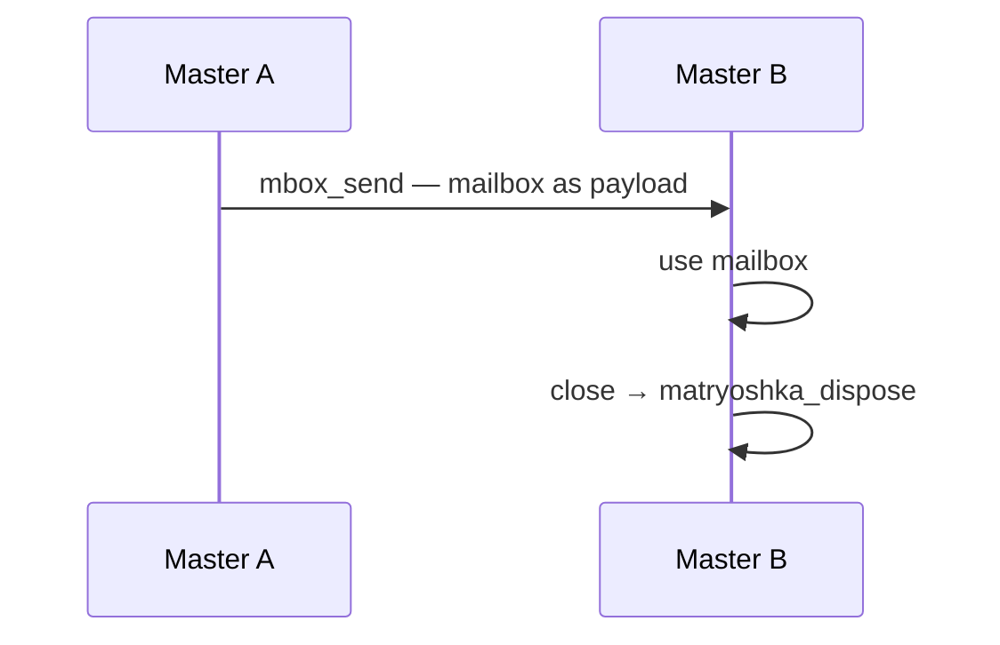

# Layer 4 — Meta — Infrastructure as Items — Deep Dive

> See [Quick Reference](layer4_quickref.md) for API shape and rules.\
>\
> **Prerequisite:** Layer 1 + Layer 2 + Layer 3.

---

## From data to infrastructure

In previous layers:

* Items were data.
* Mailbox moved items.
* Pool reused items.

Now:

* Mailbox is also an item.
* Pool is also an item.

Same ownership.\
Same movement.\
No second system.

---

## Internal layout — private tail

Mailbox and Pool follow the same rule as user types.

```odin
_Mbox :: struct {
    using poly: PolyNode,
    alloc: mem.Allocator,
    // sync and queue
}

_Pool :: struct {
    using poly: PolyNode,
    alloc: mem.Allocator,
    // lists and hooks
}
```

Offset 0 is required.

Everything else is private.

User never sees `_Mbox` or `_Pool`.

---

## Public handle

Hide internals with `distinct`.

```odin
Mailbox :: distinct ^PolyNode
Pool    :: distinct ^PolyNode
```

User works with `Mailbox` and `Pool`.

Matryoshka casts back to internal structs.

---

## ID split — data vs infrastructure

One field.\
Clear rule.

| id    | meaning     |
| ----- | ----------- |
| `0`   | invalid     |
| `> 0` | user item   |
| `< 0` | system item |

Example:

```odin
SystemId :: enum int {
    Mailbox = -1,
    Pool    = -2,
}
```

No shared ranges.

No guessing.

---

## Creation — no manager

Create directly.

```odin
mb := mbox_new(alloc)
pl := pool_new(alloc)
```

Each item stores allocator inside.

No central object.

No global registry.

---

## matryoshka_dispose — one way to clean up

One entry point for everything.

```odin
matryoshka_dispose :: proc(m: ^Maybe(^PolyNode))
```

How it works:

* If `m == nil` → return
* If `m^ == nil` → return
* Read the `id`
* Switch based on the id
* Cast to the internal struct
* Check the state

| State  | Action      |
| ------ | ----------- |
| closed | free memory |
| open   | panic       |

After success:

* `m^ = nil`

matryoshka_dispose is final.

---

## Why closed-only matryoshka_dispose?

Open infrastructure still has state.

Examples:

* Mailbox may have waiters
* Pool may have stored items

Freeing early would:

* lose items
* break waiting threads

Closed means:

* no new activity
* state is stable

---

## Mailbox as payload

Mailbox moves like any item.

### Send side:

* Convert to `^PolyNode`
* Wrap in `Maybe`
* Call `mbox_send`

### Receive side:

* Receive into `Maybe`
* Cast to `Mailbox`
* Use it

Mailbox is just data at this level.

---

## Pool as payload

Same flow.

* Can be sent
* Can be received
* Can be disposed

No special rules.

---

## Example — passing a mailbox

Master A creates mailbox.\
Master A sends it to Master B.

### Sender:

```odin
m: Maybe(^PolyNode)
m^ = (^PolyNode)(mb)

if mbox_send(out, &m) != .Ok {
    return
}
// m^ == nil
```

### Receiver:

```odin
m: Maybe(^PolyNode)

if mbox_wait_receive(in, &m) != .Ok {
    return
}

ptr, ok := m.?
if !ok { return }

mb2 := Mailbox(ptr)
```

Ownership moved.

No copy.

---

## Self-send — what really happens

Mailbox sends itself.

### Steps:

* Sender wraps mailbox
* Sender calls send
* Ownership leaves sender
* Item enters queue
* Receiver takes it

If sender and receiver are same:

* Ownership leaves current context
* Ownership returns through receive path

This is a loop.

---

## Why self-send is tricky

Mailbox is:

* transport
* now also payload

You modify transport using itself.

Problems:

* order becomes unclear
* state changes mid-flow
* debugging is harder

Use only for special control flows.

---

## Pool and infrastructure

You cannot do this.\
Do not try to use Pool's get/put for Mailboxes or Pools.\
If the pool is open, it will treat them as a "foreign" id and panic.

---

## Master with Meta

Master now may own:

* Mailbox items
* Pool items
* Data items

All are `PolyNode`.

Teardown is unified.

---

## Teardown with matryoshka_dispose

Instead of custom destroy:

* close mailbox
* wrap into `Maybe`
* call matryoshka_dispose

Example:

```odin
m: Maybe(^PolyNode) = (^PolyNode)(mb)

remaining := mbox_close(mb)
// drain remaining first

matryoshka_dispose(&m)
mb = nil  // mb is now dangling — zero it
```


Same for Pool.

---

## Full lifecycle — infrastructure move



Flow:

* create mailbox
* send mailbox
* receive mailbox
* use mailbox
* close mailbox
* matryoshka_dispose mailbox

Same pattern as data.

---

## Patterns

### Dynamic topology

* Create mailbox
* Send to another Master
* That Master connects to new flow

System shape changes at runtime.

---

### Ownership transfer of control

Mailbox represents:

* channel
* responsibility

Sending mailbox transfers both.

---

### Isolation

Each infrastructure item:

* owns its allocator
* owns its state

No hidden dependency.

---

## What changed from Layer 3

Before:

* infrastructure managed separately
* custom teardown paths

Now:

* infrastructure is item
* same ownership model
* same disposal entry

---

## What did not change

* Mailbox API
* Pool API
* Ownership rules
* Error handling

---

## What you learned (Layer 4)

* One model scales
* Infrastructure can move
* Lifecycle is unified
* Simplicity must be protected
* Infrastructure is not data
* Treat it with more care
